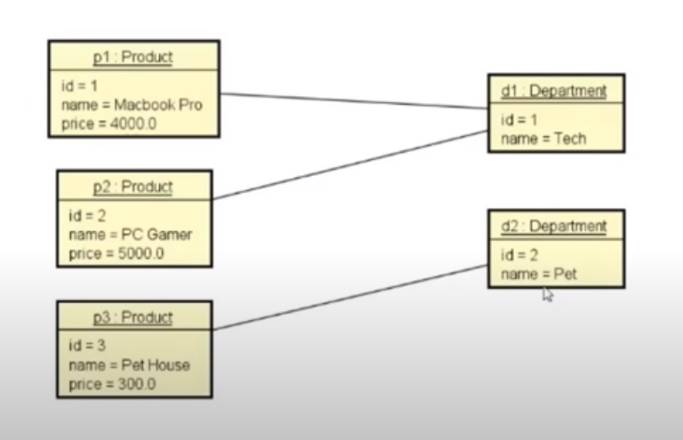

<h1 align="center">Api Java Spring Demo</h1>

Projeto Simples Demo de uma API Rest com Java e Spring

<h1 align="center">
  
</h1>

---
### Recursos

Linguagem:
 

 
Framework:
 

---

### Autor:

Desenvolvido por Rafael. 👋
 

